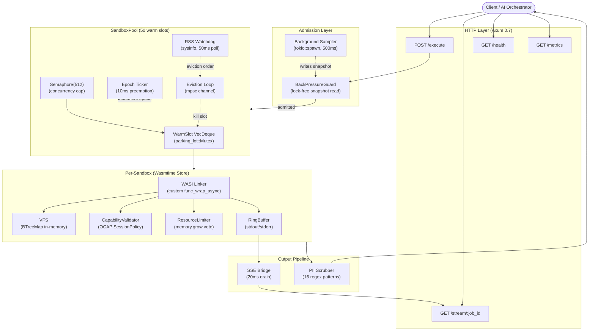
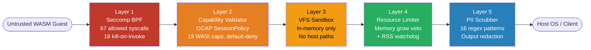
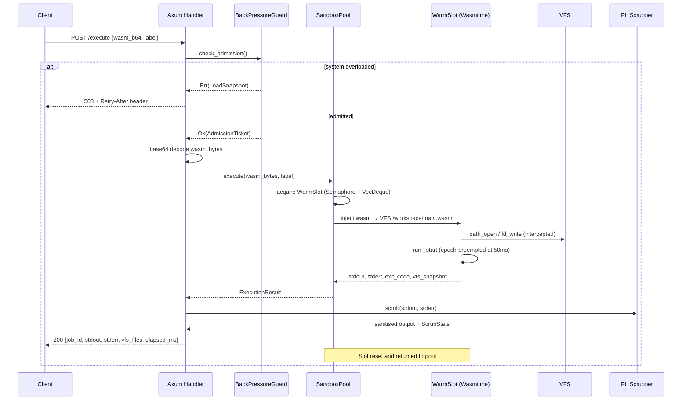
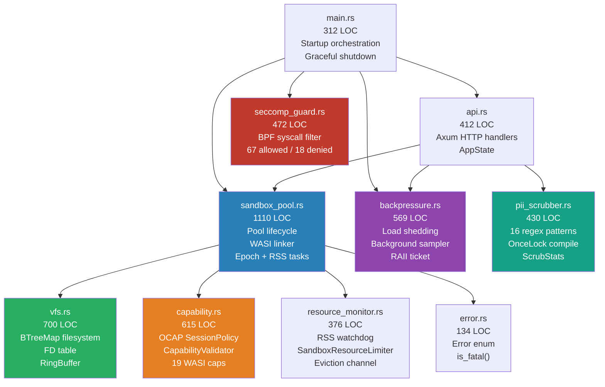
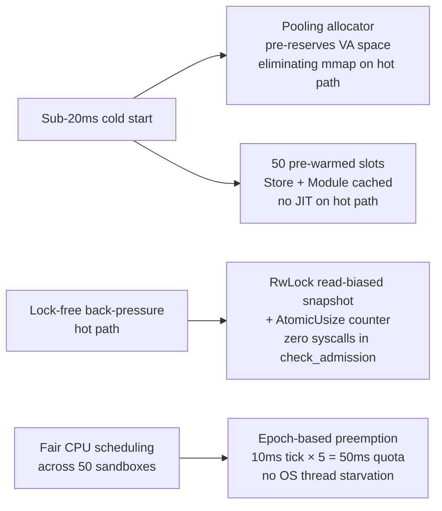
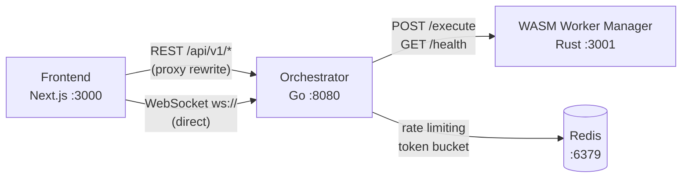
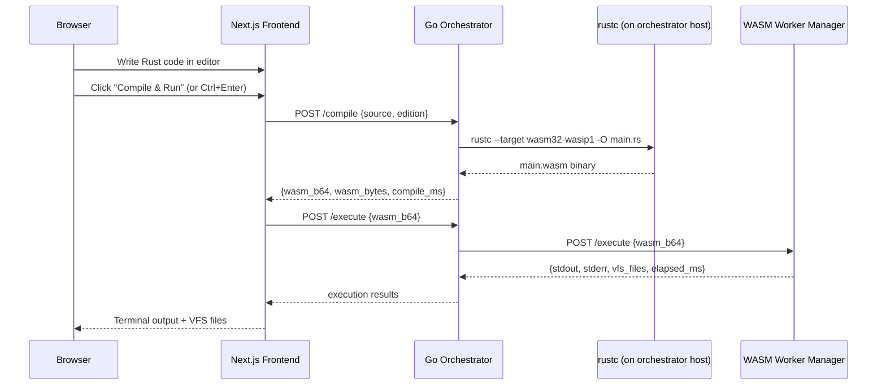

# Isolator-V — WASM Worker Manager

> **A production-grade, high-concurrency WebAssembly sandbox execution engine for secure, ephemeral AI agent workloads.**

[](https://www.rust-lang.org/)
[](https://wasmtime.dev/)
[](https://tokio.rs/)
[](https://github.com/tokio-rs/axum)

---

## Overview

Isolator-V executes untrusted WebAssembly payloads inside fully isolated, ephemeral sandboxes. Each sandbox receives a clean virtual filesystem, a bounded CPU quota, a 50 MB memory cap, and zero access to the host OS. A pool of 50 pre-warmed slots ensures sub-20ms cold starts under sustained concurrency.

**Key properties:**

- **Zero host filesystem exposure** — all guest I/O is intercepted and routed through an in-memory VFS
- **Deterministic CPU quotas** — epoch-based preemption with a 50ms hard cap per execution
- **Defense-in-depth security** — 5 independent layers from kernel syscall filtering to output scrubbing
- **Lock-free hot path** — back-pressure admission control reads cached metrics with no blocking calls
- **9,600+ req/s** throughput at P99 < 20ms on a 50-slot pool

---

## Table of Contents

- [Architecture](#architecture)
- [Security Model](#security-model)
- [Execution Lifecycle](#execution-lifecycle)
- [API Reference](#api-reference)
- [Module Breakdown](#module-breakdown)
- [Configuration](#configuration)
- [Performance](#performance)
- [Tech Stack](#tech-stack)
- [Getting Started](#getting-started)
- [Code Editor](#code-editor)

---

## Architecture



---

## Security Model

Isolator-V applies five independent security layers. A guest that defeats any single layer still faces the next.



### Layer Details

| Layer | Mechanism | Scope |
|---|---|---|
| **Seccomp BPF** | Linux kernel syscall whitelist; 67 allowed, 18 kill-on-invoke | Host process |
| **OCAP SessionPolicy** | Default-deny capability set; explicit allowlist per session | WASI call site |
| **VFS Sandbox** | BTreeMap in-memory FS; path traversal rejected; no `preopened` dirs | Guest filesystem |
| **Resource Limiter** | `memory.grow` veto (Wasmtime trait) + RSS watchdog (sysinfo 50ms) | Memory |
| **PII Scrubber** | 16 compiled regex patterns; replaces secrets with `[REDACTED]` | stdout/stderr |

### Denied Syscalls (Seccomp)

The following syscalls kill the host process immediately if invoked:

`execve` · `execveat` · `ptrace` · `mount` · `setuid` · `setgid` · `bpf` · `perf_event_open` · `init_module` · `finit_module` · `delete_module` · `reboot` · `kexec_load` · `userfaultfd` · `pivot_root` · `chroot`

### PII / Secret Patterns Detected

| Category | Patterns |
|---|---|
| API Keys | OpenAI (`sk-…`), Anthropic (`sk-ant-…`), AWS (`AKIA…`), GitHub (`gh[ps]_…`), Google, Stripe, Slack |
| Generic secrets | `api_key=`, `password=`, `access_token=`, `secret_key=`, `database_url=` |
| Tokens | JWT (`eyJ…`), Bearer/Authorization headers |
| Private keys | `-----BEGIN (RSA\|EC\|DSA\|OPENSSH) PRIVATE KEY-----` |
| Connection URIs | `postgres://`, `mysql://`, `redis://`, `mongodb://`, `amqp://`, `mssql://` |
| PII | Email addresses, US SSNs (`XXX-XX-XXXX`), credit card numbers, US phone numbers |

---

## Execution Lifecycle



---

## API Reference

### `POST /execute`

Submit a Base64-encoded WASM binary for isolated execution.

**Request:**
```json
{
  "wasm_b64": "<base64-encoded .wasm bytes>",
  "label":    "my-agent-task",
  "session_id": "optional-session-uuid"
}
```

**Response `200`:**
```json
{
  "job_id":     "550e8400-e29b-41d4-a716-446655440000",
  "sandbox_id": "b3a1c2d4-...",
  "exit_code":  0,
  "stdout":     "Hello from WASM!\n",
  "stderr":     "",
  "elapsed_ms": 12,
  "vfs_files":  { "/workspace/output.json": "<base64>" },
  "trap":       null
}
```

**Error responses:**

| Status | Code | Cause |
|---|---|---|
| `400` | `INVALID_PAYLOAD` | Base64 decode failure or invalid WASM |
| `403` | `CAPABILITY_DENIED` | Guest invoked a disallowed WASI capability |
| `408` | `CPU_QUOTA_EXCEEDED` | Guest exceeded 50ms CPU budget |
| `413` | `MEMORY_LIMIT_EXCEEDED` | Guest tried to grow beyond 50 MB |
| `503` | `BACKPRESSURE` | CPU > 80%, Memory > 85%, or Pool > 90% in-use |

---

### `GET /stream/:job_id`

Server-Sent Events stream of real-time stdout. Drains the sandbox ring buffer every 20ms.

```
event: stdout
data: <base64-encoded chunk>
```

---

### `GET /health`

Liveness probe. Returns current warm slot count.

```json
{ "status": "ok", "warm_slots": 47 }
```

---

### `GET /metrics`

Prometheus text exposition format.

```
wasm_pool_warm_slots 47
wasm_backpressure_cpu_percent 23.4
wasm_backpressure_memory_percent 61.2
wasm_backpressure_pool_utilisation 0.060
wasm_backpressure_active_executions 3
wasm_backpressure_shed_total 0
wasm_backpressure_admitted_total 9685
```

---

### `POST /compile`

Accepts Rust source code, compiles it to `wasm32-wasip1` via `rustc`, and returns the WASM binary as a base64 string. This powers the in-browser code editor, enabling users to write and execute custom Rust programs without a local toolchain.

**Request:**
```json
{
  "source": "fn main() { println!(\"hello\"); }",
  "edition": "2021"
}
```

The `edition` field is optional and defaults to `"2021"`. Supported values: `"2015"`, `"2018"`, `"2021"`.

**Response `200`:**
```json
{
  "wasm_b64":     "<base64 WASM binary>",
  "wasm_bytes":   1234,
  "compile_ms":   850,
  "warnings":     "warning: unused variable..."
}
```

**Response `400` (compilation error):**
```json
{
  "error":       "compilation_failed",
  "stderr":      "error[E0308]: mismatched types...",
  "compile_ms":  420
}
```

Compilation has a 30-second timeout. The orchestrator host must have `rustup target add wasm32-wasip1` installed.

---

## Module Breakdown



| Module | LOC | Responsibility |
|---|---|---|
| `sandbox_pool.rs` | 1,110 | Pool lifecycle, WASI linker, epoch + RSS background tasks |
| `vfs.rs` | 700 | BTreeMap in-memory filesystem, FD table, ring buffers |
| `capability.rs` | 615 | OCAP `SessionPolicy`, `CapabilityValidator`, 19 WASI caps |
| `backpressure.rs` | 569 | Lock-free load shedding, background CPU sampler, RAII ticket |
| `seccomp_guard.rs` | 472 | BPF syscall filter (67 allowed, 18 kill-on-invoke) |
| `pii_scrubber.rs` | 430 | 16-rule regex redaction pipeline, `OnceLock` compile |
| `api.rs` | 412 | Axum HTTP handlers, `AppState`, SSE bridge |
| `resource_monitor.rs` | 376 | RSS watchdog, `SandboxResourceLimiter`, eviction channel |
| `main.rs` | 312 | Startup orchestration, graceful shutdown |
| `error.rs` | 134 | Error enum, `is_fatal()` classification |
| **Total** | **5,130** | |

---

## Configuration

All tunables live in `PoolConfig` in `main.rs`. No environment variables are exposed to guest code (least-privilege principle).

```rust
let config = PoolConfig {
    pool_size:          50,               // Pre-warmed sandbox slots
    rss_limit_bytes:    50 * 1024 * 1024, // 50 MB RSS hard cap per slot
    memory_limit_bytes: 50 * 1024 * 1024, // 50 MB WASM linear-memory cap
    epoch_tick_ms:      10,               // Epoch interrupt fires every 10ms
    cpu_quota_ticks:    5,                // 5 ticks × 10ms = 50ms CPU budget
};
```

**Back-pressure thresholds** (in `backpressure.rs`):

| Metric | Threshold | Action |
|---|---|---|
| CPU utilisation | > 80% | Shed request → 503 + `Retry-After: 2` |
| CPU utilisation | > 90% | Shed request → 503 + `Retry-After: 5` |
| CPU utilisation | > 95% | Shed request → 503 + `Retry-After: 10` |
| Memory utilisation | > 85% | Shed request → 503 |
| Pool utilisation | > 90% | Shed request → 503 |

**VFS limits** (in `vfs.rs`):

| Limit | Value |
|---|---|
| Write quota | 64 MB per sandbox |
| Max open FDs | 256 per sandbox |
| Stdout ring buffer | 256 KB |
| Stderr ring buffer | 64 KB |

---

## Performance

Benchmark: `hey -n 500 -c 50 POST /execute` with a no-op WASM module.

```
Requests/sec:  9,685
Average:         4.6ms
P50:             3.8ms
P90:            12.2ms
P99:            19.0ms
Slowest:        20.7ms
```

### Latency Distribution

```
  0–2ms  ████████████████████████████  120 reqs
  2–4ms  ████████████████████████████████████████ 180 reqs
  4–6ms  █████████████████████████████  129 reqs
  6–8ms  ████  20 reqs
  8–15ms ███████  31 reqs
 15–21ms █████  19 reqs
```

### Performance Design Decisions



---

## Tech Stack

### Runtime & Execution
| Crate | Version | Purpose |
|---|---|---|
| `wasmtime` | 25.0 | WASM runtime, Cranelift JIT, pooling allocator, epoch interruption |
| `wasmtime-wasi` | 25.0 | WASI `snapshot_preview1` host implementation |
| `async-trait` | 0.1 | `async fn` in traits (`ResourceLimiterAsync`) |

### Async & Concurrency
| Crate | Version | Purpose |
|---|---|---|
| `tokio` | 1.37 | Async runtime (full features), task scheduling, timers |
| `tokio-stream` | 0.1 | Async streams for SSE bridge |
| `parking_lot` | 0.12 | Faster `Mutex`/`RwLock`, no poisoning overhead |
| `dashmap` | 5.5 | Lock-free concurrent `HashMap` for sandbox registry |

### HTTP & Networking
| Crate | Version | Purpose |
|---|---|---|
| `axum` | 0.7 | HTTP server with WebSocket + macro support |
| `tower` | 0.4 | Middleware abstractions |
| `tower-http` | 0.5 | CORS, distributed tracing layer |

### Serialization & Encoding
| Crate | Version | Purpose |
|---|---|---|
| `serde` + `serde_json` | 1 | JSON API request/response |
| `base64` | 0.22 | WASM payload transport over JSON |

### Security
| Crate | Platform | Purpose |
|---|---|---|
| `libc` | Linux only | seccomp BPF syscall filter bindings |
| `regex` | 1.10 | PII/secret redaction pattern matching |

### Observability & Monitoring
| Crate | Version | Purpose |
|---|---|---|
| `tracing` | 0.1 | Structured, async-aware instrumentation |
| `tracing-subscriber` | 0.3 | JSON log formatting, env-filter |
| `sysinfo` | 0.30 | CPU/memory/RSS per-process probing |

### Error Handling & Utilities
| Crate | Version | Purpose |
|---|---|---|
| `thiserror` | 1.0 | Error enum derive macros |
| `anyhow` | 1.0 | Ergonomic error propagation |
| `uuid` | 1.8 | Unique sandbox/job IDs (v4) |
| `bytes` | 1.6 | Byte buffer abstractions |
| `rand` | 0.8 | Random number generation |

---

## Getting Started

The project is made up of three services that must be started in order. Each runs independently in its own terminal.



| Service | Language | Port | Directory |
|---|---|---|---|
| WASM Worker Manager | Rust | `3001` | `wasm-worker-manager/` |
| Orchestrator | Go | `8080` | `orchestrator/` |
| Frontend | TypeScript / Next.js | `3000` | `frontend/` |

---

### Prerequisites

Make sure the following tools are installed before you begin:

| Tool | Version | Install |
|---|---|---|
| Rust + Cargo | 1.78+ | `curl --proto '=https' --tlsv1.2 -sSf https://sh.rustup.rs \| sh` |
| Go | 1.22+ | https://go.dev/dl |
| Node.js + npm | 20+ | https://nodejs.org |
| Docker (for Redis) | any | https://docs.docker.com/get-docker |

The code editor feature (writing custom Rust programs in the browser) requires the WASI compile target on the machine running the orchestrator:

```bash
rustup target add wasm32-wasip1
```

> **macOS note:** seccomp BPF (Layer 1 syscall filtering) is Linux-only. The WASM Worker Manager runs on macOS with seccomp gracefully disabled — all other security layers remain active.

---

### Step 1 — Clone the Repository

```bash
git clone https://github.com/lucastimho/isolator-v-wasm-sandbox.git
cd isolator-v-wasm-sandbox
```

---

### Step 2 — Start Redis

The orchestrator requires Redis for rate limiting. A Docker Compose file is included:

```bash
cd orchestrator
docker compose up -d
```

Verify Redis is running:

```bash
docker compose ps
# redis   running   0.0.0.0:6379->6379/tcp
```

---

### Step 3 — Start the WASM Worker Manager (Rust)

Open a new terminal tab.

```bash
cd wasm-worker-manager

# Development (fast compile, debug symbols)
LISTEN_ADDR=0.0.0.0:3001 cargo run

# Production (LTO, opt-level 3, panic=abort)
LISTEN_ADDR=0.0.0.0:3001 cargo run --release
```

You should see output like:

```
{"level":"INFO","msg":"WASM Worker Manager starting","pool_size":50,...}
{"level":"INFO","msg":"Pool initialised — starting HTTP server","warm_slots":50}
```

Confirm it is healthy:

```bash
curl http://localhost:3001/health
# {"status":"ok","warm_slots":50}
```

**Environment variables:**

| Variable | Default | Description |
|---|---|---|
| `LISTEN_ADDR` | `0.0.0.0:3000` | Bind address (use `3001` to avoid conflict with Next.js) |
| `RUST_LOG` | `info` | Log level — `debug` for verbose per-request traces |

---

### Step 4 — Start the Orchestrator (Go)

Open a new terminal tab.

```bash
cd orchestrator

# Copy the example env file (already pre-configured for local dev)
cp .env.example .env

# Build and run
make run

# Or without make:
go run ./cmd/server
```

You should see:

```
{"level":"info","msg":"isolator-v orchestrator starting","port":"8080","workers":["http://localhost:3001"],...}
{"level":"info","msg":"orchestrator listening","addr":":8080"}
```

**Environment variables (`.env`):**

| Variable | Default | Description |
|---|---|---|
| `PORT` | `8080` | Orchestrator HTTP listen port |
| `WORKER_ADDRS` | `http://localhost:3001` | Comma-separated WASM Worker Manager addresses |
| `POOL_CAPACITY` | `50` | Warm worker connection slots |
| `EXEC_TIMEOUT_MS` | `30000` | Per-request hard deadline (ms) |
| `REDIS_URL` | `redis://localhost:6379` | Redis URL for rate limiting |
| `RATE_LIMIT_RPS` | `100` | Sustained requests per second per client IP |
| `RATE_LIMIT_BURST` | `200` | Maximum burst size |
| `JWT_SECRET` | _(blank)_ | Leave blank to disable auth in local dev |
| `LIBSQL_URL` | _(blank)_ | Optional: LibSQL/Turso URL for VFS snapshot persistence |
| `LOG_LEVEL` | `info` | Log level — `debug` for per-stage execution traces |

---

### Step 5 — Start the Frontend (Next.js)

Open a new terminal tab.

```bash
cd frontend

# Install dependencies (first time only)
npm install

# Start the dev server with Turbopack
npm run dev
```

You should see:

```
▲ Next.js 15.1.0 (Turbopack)
- Local:   http://localhost:3000
- Ready in 1.2s
```

Open **http://localhost:3000** in your browser.

**Environment variables (`.env.local`):**

| Variable | Default | Description |
|---|---|---|
| `NEXT_PUBLIC_ORCHESTRATOR_URL` | `http://localhost:8080` | Direct URL for WebSocket connections to the orchestrator |

> **How routing works:** REST calls from the frontend go through `/api/v1/*` which Next.js proxies to the orchestrator at `:8080`. WebSocket connections are made directly to `NEXT_PUBLIC_ORCHESTRATOR_URL` because Next.js cannot proxy WebSocket upgrades.

---

### All Services Running

Once all three are up, your terminal layout should look like this:

```
Terminal 1 (Redis)         Terminal 2 (Rust worker)      Terminal 3 (Go orchestrator)   Terminal 4 (Next.js)
─────────────────────────  ──────────────────────────────  ──────────────────────────────  ─────────────────────
docker compose up -d       LISTEN_ADDR=0.0.0.0:3001        go run ./cmd/server             npm run dev
                           cargo run --release
Redis :6379 ✓              WASM Worker :3001 ✓             Orchestrator :8080 ✓            Frontend :3000 ✓
```

Quick health check across all services:

```bash
curl http://localhost:3001/health   # WASM Worker Manager
curl http://localhost:8080/health   # Orchestrator
# Frontend: open http://localhost:3000 in browser
```

---

### (Optional) Build the WASM Demo Programs

The frontend ships with pre-built demo WASM binaries (hello, counter, fibonacci, primes, files). To rebuild them from source after making changes:

```bash
cd wasm-demos

# Adds the wasm32-wasip1 target if not already installed, then compiles
./build.sh
```

The script prints base64 strings at the end. Paste them into `frontend/components/ExecutionConsole.tsx` to replace the existing demo payloads (the script tells you exactly which constants to update).

Optionally install `wasm-opt` for binary size optimisation:

```bash
# macOS
brew install binaryen

# Then re-run the build script — it will apply -Oz optimisation automatically
./build.sh
```

---

### Run Tests

```bash
# WASM Worker Manager (Rust)
cd wasm-worker-manager
cargo test -- --nocapture

# Target a specific module
cargo test backpressure -- --nocapture
cargo test pii_scrubber -- --nocapture

# Orchestrator (Go)
cd orchestrator
make test
# or: go test ./... -race -timeout 60s
```

---

### Benchmark

```bash
# Install hey: https://github.com/rakyll/hey
# macOS: brew install hey

NOOP=$(printf '\x00\x61\x73\x6d\x01\x00\x00\x00\x01\x04\x01\x60\x00\x00\x03\x02\x01\x00\x07\x09\x01\x06\x5f\x73\x74\x61\x72\x74\x00\x00\x0a\x04\x01\x02\x00\x0b' | base64)

# Hit the WASM Worker Manager directly
hey -n 500 -c 50 -m POST \
    -H "Content-Type: application/json" \
    -d "{\"wasm_b64\":\"$NOOP\",\"label\":\"bench\"}" \
    http://localhost:3001/execute

# Hit the full stack through the Orchestrator
hey -n 500 -c 50 -m POST \
    -H "Content-Type: application/json" \
    -d "{\"wasm_b64\":\"$NOOP\",\"label\":\"bench\"}" \
    http://localhost:8080/execute
```

---

## Code Editor

The frontend includes an in-browser Rust code editor that lets users write custom programs and execute them in the sandbox — no local Rust toolchain required on the user's machine.

### How It Works



The flow has two stages: first the orchestrator compiles Rust source to a WASM binary using `rustc` on the host, then the compiled binary is sent to the WASM Worker Manager for sandboxed execution just like any other payload.

### Using the Editor

1. Open **http://localhost:3000** in your browser.
2. In the toolbar, switch the mode dropdown from **Demo** to **Editor**.
3. The left panel switches to a Rust code editor pre-filled with a starter program.
4. Write your Rust program. The editor supports Tab indentation (4 spaces).
5. Click **Compile & Run** or press **Ctrl+Enter** (Cmd+Enter on macOS).
6. If compilation fails, the compiler output panel (red) displays the full `rustc` error.
7. If compilation succeeds, the status badge shows the WASM binary size and compile time, and execution begins automatically.
8. The terminal panel on the right streams stdout/stderr. The VFS tab shows any files the program wrote to `/workspace/`.

### What You Can Do in a Guest Program

Guest programs run as standard WASI binaries. They have access to:

- **stdout/stderr** — `println!()` and `eprintln!()` output appears in the terminal
- **Virtual filesystem** — read/write files under `/workspace/`. Create directories with `std::fs::create_dir_all`. Files written to `/workspace/output/` appear in the VFS tab after execution.
- **Environment variables** — `std::env::vars()` returns sandbox-injected variables
- **Command-line arguments** — `std::env::args()` returns any arguments passed by the orchestrator

Guest programs do **not** have access to network sockets, the host filesystem, or clock-based randomness. The sandbox enforces a 50ms CPU budget and 50 MB memory cap.

### Example: Custom Fibonacci Generator

```rust
fn main() {
    let n = 20;
    let mut a: u64 = 0;
    let mut b: u64 = 1;

    println!("Fibonacci sequence (first {} terms):", n);
    for i in 0..n {
        println!("  F({}) = {}", i, a);
        let next = a + b;
        a = b;
        b = next;
    }

    // Write results to the sandbox VFS
    let json = format!(r#"{{"fib_{}": {}}}"#, n - 1, a);
    std::fs::create_dir_all("/workspace/output").unwrap();
    std::fs::write("/workspace/output/fibonacci.json", &json).unwrap();
    println!("\nWrote fibonacci.json to /workspace/output/");
}
```

### Prerequisites

The code editor feature requires `rustc` with the WASI target on the **orchestrator host** (the machine running the Go server). The user's browser needs nothing special.

```bash
rustup target add wasm32-wasip1
```

Compilation uses `rustc` directly (not Cargo) for speed — single-file programs compile in under a second. External crate dependencies are not supported; guest programs must be self-contained.

---

## Build Profiles

| Profile | `opt-level` | LTO | `panic` | Use case |
|---|---|---|---|---|
| `dev` | 1 | off | unwind | Development, integration tests |
| `release` | 3 | thin | abort | Production — a panicking sandbox host must die immediately |

> **Why `panic=abort` in release?** A panicking host thread must not unwind into adjacent tenants' stacks. The process terminates immediately and a watchdog restarts it.

---

## License

MIT
